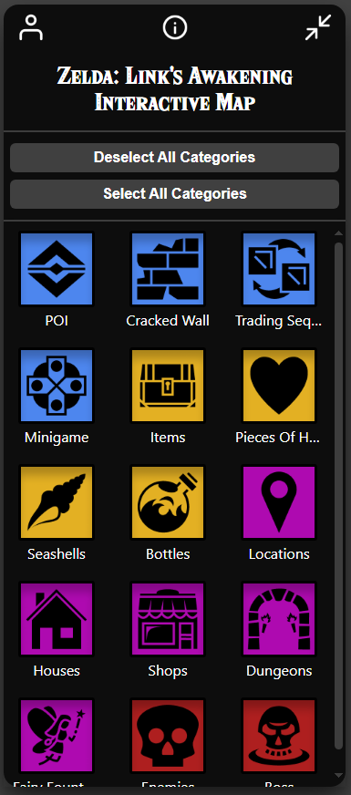

<style>
   body {
      background-color: #17202f !important;
      color: white !important;
   }

   .markdown-body pre {
      background-color: #f6f8fa26 !important;
   }

   .highlight {
      background-color: unset !important;
   }
</style>

# SAE - Carte interactive jeu vidéo : <u>Zelda: Link's Awakening</u>

## Lien direct
Vous pouvez accéder à l'application via le lien suivant : [http://unicron-la.great-site.net/](http://unicron-la.great-site.net/)  
**OU**  
Vous pouvez aussi faire tourner le projet en local (voir ci-après [Prérequis & Éxécution](#prérequis)).

## Fonctionnement
**<u>Zelda: Link's Awakening</u>** est une carte interactive contenant des *markers* (des points d'intérêt du jeu). Vous pouvez alors **sélectionner un *marker* pour obtenir des informations sur ce dernier**.  


Pour naviguer sur cette carte, vous pouvez :
- Simplement vous déplacer avec votre souris, zoomer/dézoomer avec la molette, utiliser le clic-droit pour créer un marqueur personnalisé (voir plus loin pour d'autres informations sur les marqueurs personnalisés)  
**OU**  
- Également zoomer/dézoomer et remettre la vue par défaut grâce aux boutons de contrôle situé à droite  


Ces *markers* sont regroupés **par catégorie** que vous pouvez observés dans le panneau de gauche.  
**Ces catégories sont elles même issues de catégorie mère** qui correspondent au premier choix de chaque nouvelle couleur (POI, Items, etc.)  
  
Ce panneau vous permet également de vous connecter/inscrire à l'application qui vous donne donc plusieurs avantages/possibilités à savoir :
- Créer des *markers* **personnalisés** ;
- Marquer un *marker* comme "Favoris" ou "Complété" ;
- Filtrer par "Favoris" ou "Complété".

## Prérequis
Pour exécuter l'application, vous aurez besoin de :
1. **Télécharger le projet**. Vous avez alors deux choix possible à savoir :
   - Vous rendre sur [https://github.com/Unicron03/map-LA/](https://github.com/Unicron03/map-LA/) puis bouton "Code" puis bouton "Download ZIP" et enfin décompresser le projet ;  
   **OU**
   - Via GitBash en clonant le projet à l'aide de la commande suivante :
   ```bash
   git clone https://github.com/Unicron03/map-LA.git
   ```
2. **Télécharger, si besoin, un interpréteur PHP/MySQL** (Exemple XAMPP : [https://www.apachefriends.org/download.html](https://www.apachefriends.org/download.html)), y déposer le projet et charger dans PHPMyAdmin le fichier map-LA.sql.

## Exécution
**Une fois tous les prérequis complétés** vous pourrez alors éxécuter l'application.  
Pour cela :  
1. **Lancer les serveurs** Apache et PHPMyAdmin (ou autres nécessaires) ;
2. Remplacer les variables <span style="color: #d1b57b;">`pdoUserName`</span> et <span style="color: #d1b57b;">`pdoUserPassword`</span> avec vos identifiants PHPMyAdmin ;
3. Ouvrez l'application web via le lien suivant : [http://localhost/map-LA](http://localhost/map-LA).

## Notes
Vous pouvez tester d'utiliser un compte commun dont voici les identifiants de connexion :
- Identifiant : <span style="color: #348aec;">account.example@gmail.com</span>
- Mot de passe : ilovecats


>Vous disposez également d'une version sans Leaflet, mais elle n'est pas recommandée (ne disposant pas des dernières fonctionnalités et n'étant pas une version stable). Elle est présente davantage à titre de maquette graphique que fonctionnelle.
>> Néanmoins, pour l'exécuter, il vous suffit de lancer le fichier <span style="color: #d1b57b;">`index.html`</span> du répertoire 'ANCIENTVERSION'.  
**OU**  
De vous rendre sur le lien suivant [https://unicron03.github.io/map-LA/ANCIENTVERSION/](https://unicron03.github.io/map-LA/ANCIENTVERSION/)